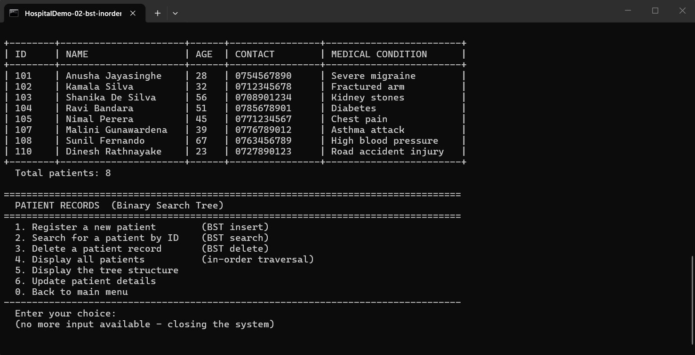
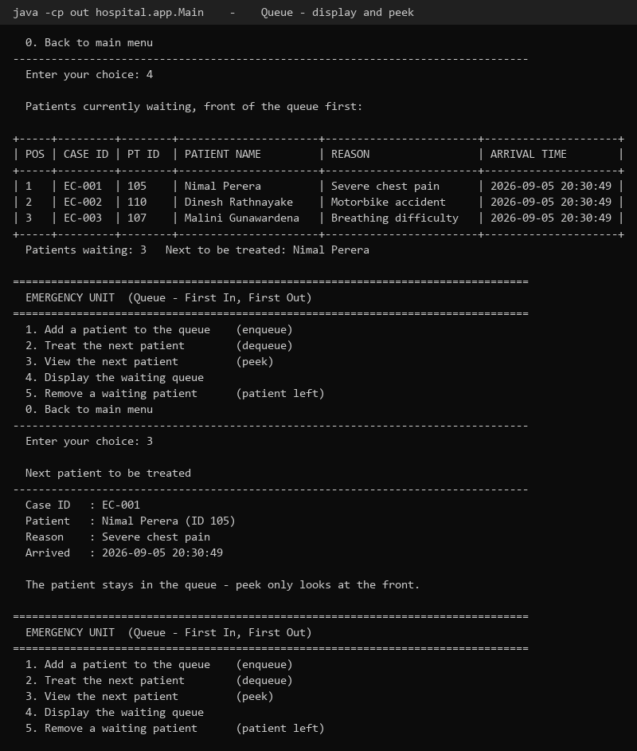
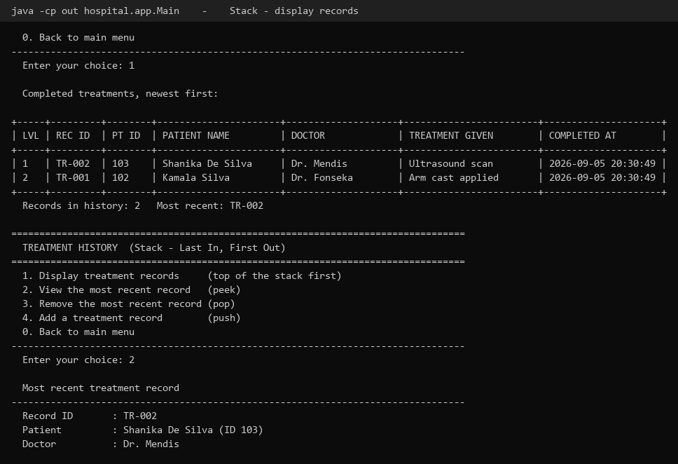
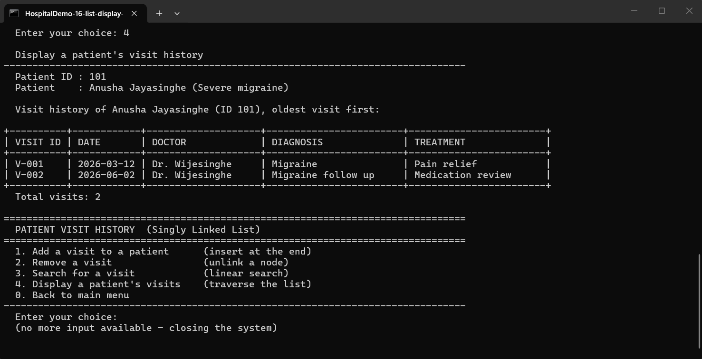

# Mini Hospital Emergency Management System

A console based hospital emergency management system written in Java for **CIT300 - Data
Structures and Algorithms (Individual Mid Assignment)**.

The system simulates the daily flow of a small hospital: patients are registered, they
arrive at the emergency unit, they are treated in turn, and every completed treatment is
kept both as a treatment record and as an entry in that patient's visit history.

All four data structures are **implemented from scratch**. No class from
`java.util` collections (`ArrayList`, `LinkedList`, `Queue`, `Stack`, `TreeMap`, ...) is
used anywhere in the system - only plain nodes and references.

| Module                | Data structure     | Class                                                                   |
|-----------------------|--------------------|-------------------------------------------------------------------------|
| Patient records       | Binary Search Tree | [`PatientBST`](src/hospital/datastructures/PatientBST.java)             |
| Emergency unit        | Queue (FIFO)       | [`EmergencyQueue`](src/hospital/datastructures/EmergencyQueue.java)     |
| Treatment history     | Stack (LIFO)       | [`TreatmentStack`](src/hospital/datastructures/TreatmentStack.java)     |
| Patient visit history | Singly Linked List | [`VisitLinkedList`](src/hospital/datastructures/VisitLinkedList.java)   |

---

## Submission details

| Field        | Value                                     |
|--------------|-------------------------------------------|
| Student name | Yohan Udara                               |
| Student ID   | 2296                                      |
| Course       | CIT300 - Data Structures and Algorithms   |
| Assignment   | Individual Mid Assignment                 |
| Language     | Java (compiles on JDK 8 and newer, developed on JDK 21) |

---

## Quick start

**Windows**

```
run.bat
```

**Linux, macOS or Git Bash**

```
./run.sh
```

**Manually, with nothing but the JDK**

```
javac -d out $(find src -name "*.java")
java -cp out hospital.app.Main
```

**Run the test suite**

```
run-tests.bat        (Windows)
./run-tests.sh       (Linux / macOS / Git Bash)
```

**In an IDE (IntelliJ IDEA, Eclipse, NetBeans, VS Code)**

Open the folder as a project, mark `src` as the sources root, then run
`hospital.app.Main`.

The first thing to do after starting is option **6 - Load Sample Data**, which fills the
system with 8 patients, 5 past visits, 2 completed treatments and 3 patients waiting in
the emergency queue, so every operation can be demonstrated immediately.

---

## Project structure

```
.
├── src/
│   └── hospital/
│       ├── app/
│       │   ├── Main.java                  Menu driven console front end
│       │   └── ConsoleInput.java          Input reading and validation helper
│       ├── datastructures/
│       │   ├── PatientBST.java            Binary Search Tree  - patient records
│       │   ├── EmergencyQueue.java        Queue (FIFO)        - emergency unit
│       │   ├── TreatmentStack.java        Stack (LIFO)        - treatment history
│       │   ├── VisitLinkedList.java       Singly Linked List  - visit history
│       │   └── EmptyStructureException.java
│       ├── model/
│       │   ├── Patient.java               Patient record, owns one VisitLinkedList
│       │   ├── Visit.java                 One past hospital visit
│       │   ├── EmergencyCase.java         A patient waiting in the emergency unit
│       │   └── TreatmentRecord.java       A completed treatment
│       ├── service/
│       │   └── HospitalSystem.java        Hospital workflow, owns the four structures
│       └── tests/
│           └── DataStructureTests.java    132 checks, no external test library
├── docs/
│   ├── screenshots/                       23 screenshots + a gallery README
│   ├── sample-output/                     Full text transcripts of the demo runs
│   ├── demo-scripts/                      Input files that produce those transcripts
│   ├── video-script.md                    Plan for the demonstration video
│   └── make-screenshots.py                Renders the transcripts into the screenshots
├── run.bat / run.sh                       Build and run
├── run-tests.bat / run-tests.sh           Build and run the tests
└── README.md
```

The code is split into four layers so that each one has a single job: `model` holds the
data, `datastructures` holds the algorithms, `service` holds the hospital rules, and
`app` only deals with the console. A data structure class never asks the user anything,
and the menu never touches a node.

---

## The four data structures

### 1. Patient records - Binary Search Tree

Every patient record is a node in a BST keyed on the **Patient ID**, so for every node:

```
all IDs in the left subtree  <  node ID  <  all IDs in the right subtree
```

| Operation                | Method                        | Average    | Worst case |
|--------------------------|-------------------------------|------------|------------|
| Insert a patient         | `insert(Patient)`             | O(log n)   | O(n)       |
| Search by Patient ID     | `search(int)`                 | O(log n)   | O(n)       |
| Delete a patient         | `delete(int)`                 | O(log n)   | O(n)       |
| In-order traversal       | `displayInOrder()`            | O(n)       | O(n)       |
| Smallest / largest ID    | `findMin()` / `findMax()`     | O(log n)   | O(n)       |

Implementation notes:

* **Insert** walks down the tree comparing IDs and hangs the new node on the first empty
  branch it reaches. A duplicate Patient ID is rejected and the size is not changed,
  because an ID has to identify exactly one patient.
* **Search** follows a single root-to-node path. The menu also prints that path
  (`105 -> 102 -> 104 -> 103`), which shows that finding a record among eight patients
  took four comparisons instead of eight.
* **Delete** handles the three standard cases: a leaf is detached, a node with one child
  is replaced by that child, and a node with two children is replaced by its **in-order
  successor** (the smallest ID in its right subtree), which is then deleted from the right
  subtree. That keeps the ordering rule intact, which the tests verify by checking the
  in-order traversal after each kind of deletion.
* **In-order traversal** (left, node, right) prints the patients in ascending order of
  Patient ID without any sorting step - the ordering comes free with the structure.
* The `patientId` field is `final`. Changing the key of a node that is already in the tree
  would silently break the search, so the menu allows every other field to be edited but
  never the ID.

The worst case O(n) happens when IDs are inserted in ascending order and the tree becomes
a single chain. It is a known limitation of a plain BST; a self balancing tree (AVL or
red-black) would keep the height at O(log n), and that is the natural next step for this
project.

### 2. Emergency unit - Queue (FIFO)

A linked queue with both a `front` and a `rear` reference.

| Operation                    | Method                    | Complexity |
|------------------------------|---------------------------|------------|
| Add a patient                | `enqueue(EmergencyCase)`  | O(1)       |
| Take the next patient        | `dequeue()`               | O(1)       |
| Look at the next patient     | `peek()`                  | O(1)       |
| Display everybody waiting    | `display()`               | O(n)       |
| Remove a patient who left    | `removeByPatientId(int)`  | O(n)       |

Implementation notes:

* Patients are always added at the rear and always removed from the front, so the first
  patient to arrive is the first to be treated - the FIFO rule the assignment asks for.
* Keeping a `rear` reference makes `enqueue` O(1). Without it every arrival would have to
  walk to the end of the list.
* A linked queue was chosen over an array based one because an emergency unit has no fixed
  capacity, and because a circular array would add index arithmetic that this system does
  not need.
* When the last patient is dequeued, `rear` is set back to `null`. If it were left
  pointing at the removed node, the next arrival would be linked behind a node that is no
  longer in the queue. The test suite checks this case explicitly.
* `dequeue()` and `peek()` on an empty queue throw an `EmptyStructureException` which the
  menu catches and reports as *"The emergency queue is empty - nobody is waiting."*

### 3. Treatment history - Stack (LIFO)

A linked stack: every node points to the node below it, and `top` points at the newest
record.

| Operation                     | Method                     | Complexity |
|-------------------------------|----------------------------|------------|
| Store a completed treatment   | `push(TreatmentRecord)`    | O(1)       |
| Remove the newest record      | `pop()`                    | O(1)       |
| Read the newest record        | `peek()`                   | O(1)       |
| Display the history           | `display()`                | O(n)       |

Implementation notes:

* LIFO fits the way treatment records are reviewed: the treatment that was just completed
  is the one most likely to be checked or corrected, and it is the first one the system
  gives back.
* `pop()` is used as an **undo**. Because a treatment record stores the ID of the visit it
  created, popping a record also removes that visit from the patient's linked list, so an
  entry made by mistake disappears completely.
* Push and pop only touch the `top` reference, so both are O(1) no matter how many records
  are stored.
* `pop()` and `peek()` on an empty stack throw `EmptyStructureException`, reported by the
  menu as *"The treatment history is empty."*

### 4. Patient visit history - Singly Linked List

Each `Patient` object owns **its own** `VisitLinkedList`, so the history grows and shrinks
per patient. Each node holds one visit and a single `next` reference - there is no
`previous` link, which is what makes the list singly linked.

| Operation                | Method                    | Complexity |
|--------------------------|---------------------------|------------|
| Add a visit at the end   | `addVisit(Visit)`         | O(1)       |
| Add a visit at the front | `addVisitFirst(Visit)`    | O(1)       |
| Search by Visit ID       | `searchVisit(String)`     | O(n)       |
| Remove a visit           | `removeVisit(String)`     | O(n)       |
| Display the history      | `display()`               | O(n)       |

Implementation notes:

* New visits are appended at the tail, which keeps the history in chronological order
  (oldest visit first). A `tail` reference makes that O(1) instead of walking the whole
  list on every append.
* Removal re-links the previous node past the removed one. The three positions - head,
  middle and tail - are all handled, and the `tail` reference is updated when the last node
  is removed, otherwise the next append would attach to a node that is no longer in the
  list.
* Search is linear because a linked list has no ordering to exploit. That is acceptable
  here: one patient has a handful of visits, unlike the patient register which holds every
  patient and therefore uses a tree.
* Duplicate Visit IDs inside one history are rejected.

---

## How the structures work together

The interesting part of the system is that a single menu action touches several
structures at once.

```
  Register a patient
        |
        v
  +--------------------+
  |   BST (records)    |  insert, keyed on Patient ID
  +--------------------+
        |
        |  patient arrives at the emergency unit
        v
  +--------------------+
  |   QUEUE (waiting)  |  enqueue at the rear
  +--------------------+
        |
        |  "Treat the next patient"
        v
     dequeue from the front
        |
        +----------------------------> +----------------------------+
        |                              |  LINKED LIST (that patient |
        |                              |  visit history) - append   |
        |                              +----------------------------+
        |
        +----------------------------> +----------------------------+
                                       |  STACK (treatment history) |
                                       |  - push the new record     |
                                       +----------------------------+

  "Remove the most recent record" pops the stack and removes the visit it created
  from the patient's linked list, undoing the whole step.
```

Two more rules connect the structures:

* Deleting a patient also removes them from the emergency queue, otherwise the queue would
  hold a case whose patient record no longer exists.
* Treatment records are **kept** when a patient record is deleted, because the stack is the
  hospital's treatment log and has to stay complete for auditing.

---

## Menu guide

```
MAIN MENU
  1. Patient Records          (Binary Search Tree)
  2. Emergency Unit           (Queue - FIFO)
  3. Treatment History        (Stack - LIFO)
  4. Patient Visit History    (Singly Linked List)
  5. System Summary
  6. Load Sample Data
  0. Exit
```

| Menu | Options                                                                                             |
|------|-----------------------------------------------------------------------------------------------------|
| 1    | Register a patient (insert), search by ID, delete, display all (in-order), draw the tree, update details |
| 2    | Add to the queue (enqueue), treat the next patient (dequeue), view the next patient (peek), display the queue, remove a patient who left |
| 3    | Display records, view the newest (peek), remove the newest (pop), add a record (push)                |
| 4    | Add a visit, remove a visit, search for a visit, display a patient's history                        |
| 5    | Sizes of all four structures, BST height, ID range, who is next, last treatment                     |
| 6    | Load the sample hospital data                                                                        |

Every input is validated: a Patient ID has to be a number in range, text fields cannot be
blank, deletions ask for confirmation, and an unknown Patient ID produces a message rather
than an exception.

---

## Screenshots

One screenshot per data structure is shown below. The full set of **23 screenshots**,
covering every operation including insert, delete, enqueue, dequeue, push, pop, search,
removal, the empty structure messages and the test run, is in the gallery at
**[`docs/screenshots`](docs/screenshots)**. The complete text transcripts they come from
are in [`docs/sample-output`](docs/sample-output).

**Binary Search Tree - in-order traversal.** Patients were inserted in the order 105, 102,
108, 101, 104, 107, 110, 103 and come back sorted by Patient ID with no sorting step.



**Queue - the emergency waiting line**, front of the queue first, and peek, which leaves
the patient in place.



**Stack - the treatment history**, newest record at level 1.



**Singly Linked List - one patient's visit history**, oldest visit first.



> The remaining 19 screenshots - the tree drawing, BST insert/search/delete, enqueue and
> dequeue, push and pop, adding and removing visits, the empty queue and empty stack
> handling, the full integration workflow and the test result - are all in the
> [screenshot gallery](docs/screenshots).

---

## Testing

[`DataStructureTests`](src/hospital/tests/DataStructureTests.java) runs **132 checks** with
no external test library, and exits with code 1 if any of them fail.

```
=================================================================
  RESULT: 132 passed, 0 failed, 132 checks in total
=================================================================
```

What is covered:

* **BST** - insert, duplicate rejection, search hit and miss, the search path, `findMin`,
  `findMax`, height, and all three deletion cases, each one followed by a check that the
  in-order traversal is still sorted.
* **Queue** - FIFO order, `peek` not removing anything, exceptions on an empty queue,
  reuse after the queue is drained, and out-of-order removal from the head, the middle and
  the tail.
* **Stack** - LIFO order, `peek` not removing anything, exceptions on an empty stack,
  counting the records of one patient, and the order returned by `toArray`.
* **Linked list** - append order, duplicate rejection, search, removal from the head, the
  middle and the tail, and appending again after the tail was removed.
* **Integration** - treating a patient dequeues, appends a visit and pushes a record; undo
  pops the record and removes that visit; deleting a patient clears their queue entry.

The transcripts in `docs/sample-output` are produced by feeding the input files in
`docs/demo-scripts` into the program, for example:

```
java -cp out hospital.app.Main --echo < docs/demo-scripts/01-bst-operations.txt
```

The `--echo` argument prints back the lines that are read, so the saved transcript shows
the answers next to the prompts. Without it the program behaves normally.

---

## Design decisions

1. **The structures were written from scratch.** The point of the assignment is the
   structure itself, so `java.util` collections are not used - only nodes and references.
2. **Four layers.** `model` (data), `datastructures` (algorithms), `service` (hospital
   rules), `app` (console). A structure class never reads input, and the menu never touches
   a node, so the same structures could be reused behind a different interface.
3. **An exception for empty structures.** `dequeue`, `pop` and `peek` throw
   `EmptyStructureException` instead of returning `null`. Returning `null` would let a
   caller forget the check; an exception cannot be ignored. The menu catches it and prints
   a plain message, never a stack trace.
4. **The Patient ID is immutable.** It is the BST key, so it is `final` and the update
   option deliberately does not offer to change it.
5. **Every patient owns their own linked list.** Visit history is per patient, so the list
   lives inside the `Patient` object rather than in one global list that would have to be
   filtered.
6. **A treatment record remembers its visit.** That one field is what makes "remove the
   most recent record" able to undo the whole treatment step.
7. **Front and rear, head and tail.** Both the queue and the linked list keep a reference
   to their last node, which turns two O(n) operations into O(1).
8. **Generated IDs.** Case IDs (`EC-001`), record IDs (`TR-001`) and visit IDs (`V-001`)
   are generated by the service, so the user cannot create duplicates by mistake.

---

## Development history

The repository was built up in small commits, one per piece of functionality, rather than
as a single upload:

```
Created project structure with build scripts and .gitignore
Added Patient and Visit model classes
Added EmergencyCase and TreatmentRecord model classes
Implemented patient BST with insert and in-order traversal
Added BST search, deletion and tree utility operations
Implemented emergency patient queue with FIFO operations
Implemented treatment history stack with LIFO operations
Implemented patient visit history singly linked list and linked it to Patient
Replaced String.repeat with a helper so the project builds on older JDKs
Added hospital service layer connecting all four data structures
Added console menu application with input validation
Added testing: 132 checks covering the BST, queue, stack, linked list and their integration
Added demo input scripts and captured sample program output
Added screenshots of program output for every data structure operation
Updated README with full documentation
```

`git log --oneline` shows the full history.

---

## Assignment checklist

| Requirement                                            | Where                                                                    |
|--------------------------------------------------------|--------------------------------------------------------------------------|
| BST: insert, search, delete, in-order traversal        | [`PatientBST`](src/hospital/datastructures/PatientBST.java), menu 1       |
| Patient record fields (ID, name, age, contact, condition) | [`Patient`](src/hospital/model/Patient.java)                          |
| Queue: enqueue, dequeue, display, empty handling       | [`EmergencyQueue`](src/hospital/datastructures/EmergencyQueue.java), menu 2 |
| Stack: push, pop, display, empty handling              | [`TreatmentStack`](src/hospital/datastructures/TreatmentStack.java), menu 3 |
| Linked list: add, remove, search, display              | [`VisitLinkedList`](src/hospital/datastructures/VisitLinkedList.java), menu 4 |
| Visit fields (ID, date, doctor, diagnosis, treatment)  | [`Visit`](src/hospital/model/Visit.java)                                 |
| Project structure, README, commit history              | this file, `src/`, `docs/`, `git log`                                    |
| Screenshots of program output                          | [`docs/screenshots`](docs/screenshots)                                   |
| Demonstration video                                    | plan in [`docs/video-script.md`](docs/video-script.md)                   |
